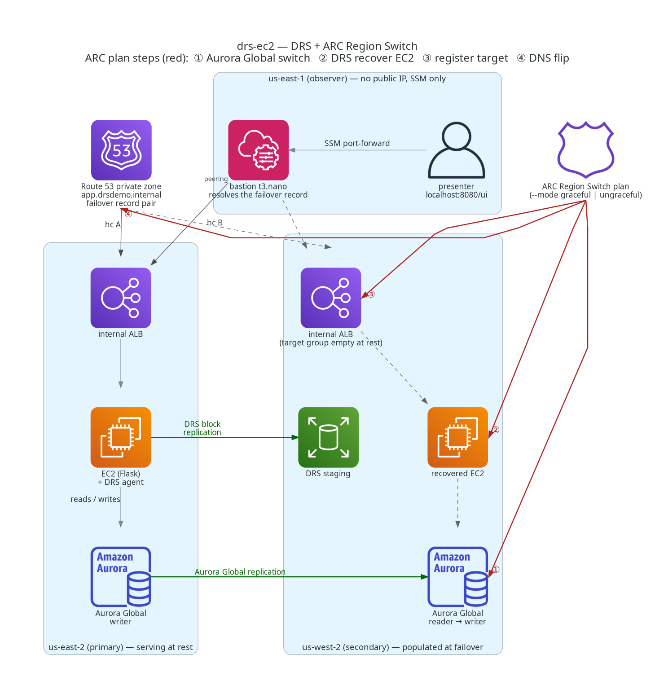

# Amazon EC2 disaster recovery with AWS Elastic Disaster Recovery and Amazon Application Recovery Controller (ARC) Region switch

Deploy this three-AWS-Region sample in your account to replicate an Amazon EC2 application with AWS Elastic Disaster Recovery (AWS DRS), switch an Amazon Aurora Global Database writer, and route traffic with Amazon Route 53. An Amazon Application Recovery Controller (ARC) Region switch plan coordinates failover and fail-back.

## Architecture



`us-east-2` serves traffic at rest. AWS DRS replicates to `us-west-2`. The `us-east-1` observer VPC contains an AWS Systems Manager (SSM) Session Manager bastion. It is peered to both workload VPCs.

**Activate secondary (fail over)** runs four plan steps:

1. Aurora Global Database switchover through the native ARC `GlobalAuroraConfig` block. `switchoverOnly` gives zero data loss. You can select `ungraceful: failover` when you start the execution.
2. `recover`: calls `StartRecovery` for the tagged source server, waits for the launch job, and adopts the recovery instance.
3. `register-target`: points the DB-writer SSM parameter at the new writer, registers the recovered instance in the secondary target group, and waits for `healthy`.
4. DNS flip through the native ARC `Route53HealthCheck` block, which switches the health checks bound to the Route 53 failover record pair.

**Activate primary (fail back)** activates the original Region. `activePassive` plans have no deactivate step. In stateless mode the plan switches Aurora back, runs `register-failback` and `retire`, then flips DNS back. With `STATEFUL_EC2=true`, the plan also runs `reverse-replicate`, `failback-launch`, and `reprotect`, so the disks that served in the DR Region return to the stopped original instance. See [`docs/failback-stateful.png`](docs/failback-stateful.png).

Every fail-back ends at the same resting state: the original instance is protected again, no recovery instances remain, and the secondary target group is empty. The application reads its Region from the instance metadata service and resolves the DB writer from SSM on every request, so it follows the writer without a restart.

## Reuse the DRS steps

[`lib/constructs/drs-region-switch-steps.ts`](lib/constructs/drs-region-switch-steps.ts) provides `DrsRegionSwitchSteps` and `DrsRegionSwitchPlanSteps`. Deploy seven AWS Lambda functions per Region from `lambda/drs_region_switch/`, with a 1-day log group per function. Use `activateSecondarySteps`, `activatePrimarySteps`, `interleaveActivatePrimary(...)`, and `grantInvoke(role)` in `lib/plan-stack.ts`. For Terraform, see [`terraform/README.md`](terraform/README.md).

## Resources deployed

| Stack | AWS Region | Core resources |
|---|---|---|
| `drsdemo-net-primary` | us-east-2 | VPC `10.0.0.0/16`, 2 public and 2 private subnets, NAT, primary peering requester |
| `drsdemo-net-secondary` | us-west-2 | VPC `10.1.0.0/16`, same subnet layout, return routes |
| `drsdemo-iam` | us-east-2 | Application instance role and profile |
| `drsdemo-db-primary` | us-east-2 | Aurora Global Database, Serverless v2, PostgreSQL 16, admin secret |
| `drsdemo-db-secondary` | us-west-2 | Secondary regional cluster |
| `drsdemo-app-primary` | us-east-2 | Private hosted zone with 3 VPC associations, internal Application Load Balancer, `t2.small` application, PRIMARY record |
| `drsdemo-alb-secondary` | us-west-2 | Internal Application Load Balancer, empty target group, recovered-application security group, SECONDARY record |
| `drsdemo-drs-steps-primary` | us-east-2 | Seven AWS Lambda functions and orchestration role |
| `drsdemo-drs-steps-secondary` | us-west-2 | Same resources for `regionToRun` in the secondary |
| `drsdemo-plan` | us-east-2 | `activePassive` ARC Region switch plan, recovery time objective (RTO) 30 min, execution role |
| `drsdemo-observer` | us-east-1 | Observer VPC, `t3.nano` Session Manager bastion, workload peering |

AWS CloudFormation does not create the AWS DRS source server or application-code bucket. `scripts/drs-setup.sh` initializes AWS DRS in both Regions, configures launch templates, installs the agent through SSM, and waits for `CONTINUOUS`.

## Prerequisites

- AWS CDK bootstrapped in `us-east-2`, `us-west-2`, and `us-east-1`.
- AWS CLI v2. Pass `PROFILE=<name>` to `make`, set `AWS_PROFILE`, or use the default credential chain.
- Node.js 20+, Python 3.12+ (for the Lambda unit tests), `make`, and the Session Manager plugin for the AWS CLI.
- Optional: `ACCOUNT=<12-digit account ID>` makes every target refuse to run against any other account.

Set `PRIMARY_REGION`, `SECONDARY_REGION`, and `OBSERVER_REGION` to override defaults.

## Deploy

```bash
npm ci
make deploy PROFILE=<aws-profile>
make status PROFILE=<aws-profile>
make help
```

From an empty account, `make deploy` takes ~60 min. The 11 stacks take ~50 min, including two Aurora clusters. AWS DRS takes ~12 min to reach `CONTINUOUS`. Re-running refreshes the application through SSM instead of replacing the instance. Set `STATEFUL_EC2=true` for stateful fail-back. Use `make stacks` for stacks only.

**Cost:** You incur charges while the sample runs. Run cleanup after testing.

## Test and rehearse

```bash
npx projen test
cd lambda && python -m pytest -q
make lint
make rehearse
make rehearse MODE=ungraceful
make rehearse-cycle LEGS=4
STATEFUL_EC2=true make rehearse-cycle LEGS=2
make tunnel
```

For an 8 GB root volume, stateless rehearsal takes ~10 min out and ~5 min back. Stateful fail-back takes ~45 min and scales with disk size. After an ungraceful failover, the old primary is `pending-resync` for 10–18 min. ARC waits until it is `available` before switchover-back. `make tunnel` opens `http://localhost:8080/ui` through the bastion.

## AWS DRS requirements

- The `StartRecovery` caller needs the EC2 permissions from `AWSElasticDisasterRecoveryConsoleFullAccess`, `iam:PassRole`, and the 16 AWS DRS actions listed in [`lib/constructs/drs-region-switch-steps.ts`](lib/constructs/drs-region-switch-steps.ts). A gap can surface as `LAUNCH_FAILED` after a ~5-minute conversion.
- Configure the generated AWS DRS launch template with a subnet, security group, and instance profile. For launch-into-source, use BIOS boot, `AWSDRS=AllowLaunchingIntoThisInstance`, and a stopped target instance.
- One Amazon Route 53 record has one `HealthCheckId`. AWS DRS account settings persist outside AWS CloudFormation and create two security groups per staging VPC. `cleanup.sh` removes them.
- To remove stateful fail-back resources, stop replication on the FAILBACK server, terminate the recovery instance, then delete the FAILBACK server. The application sends `Connection: close` to avoid a retained Application Load Balancer IP through an SSM port-forward.

## Cleanup

```bash
make clean PROFILE=<aws-profile>
```

You can also run `./cleanup.sh`. Cleanup takes ~30 min. Re-run it after a failure. A `DELETE_FAILED` stack is re-issued once and prints its failing resources.

## Security

Report security issues through Security issue notifications in [CONTRIBUTING.md](../CONTRIBUTING.md).

This demo uses HTTP through internal Application Load Balancers, password authentication, disabled deletion protection, no Application Load Balancer access logs, no VPC flow logs, no detailed monitoring, and no secret rotation. AWS DRS replicates the root volume as-is.

The cdk-nag exceptions document these demo choices: `AwsSolutions-IAM4`, `AwsSolutions-IAM5`, `AwsSolutions-EC23`, `AwsSolutions-EC26`, `AwsSolutions-EC28`, `AwsSolutions-EC29`, `AwsSolutions-ELB2`, `AwsSolutions-RDS6`, `AwsSolutions-RDS10`, `AwsSolutions-RDS11`, `AwsSolutions-SMG4`, `AwsSolutions-VPC7`, and `AwsSolutions-L1`. `AwsSolutions-IAM4` covers documented service policies. `AwsSolutions-IAM5` covers caller-credential AWS DRS permissions. `AwsSolutions-RDS6` uses Secrets Manager. `AwsSolutions-L1` uses Python 3.12.

## Limits

The sample uses one Amazon EC2 instance, one writer, and a private hosted zone. The secondary target group is empty at rest. All `make` targets are non-interactive, set `AWS_PAGER` empty, and pass `--no-cli-pager`.

## License

MIT-0. See [LICENSE](../LICENSE). For third-party components, see [THIRD-PARTY-LICENSES](THIRD-PARTY-LICENSES).
